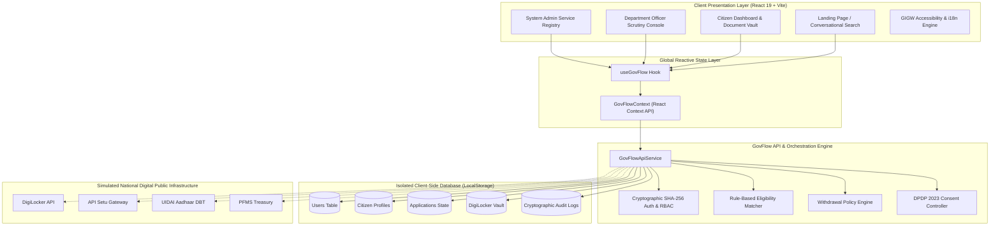
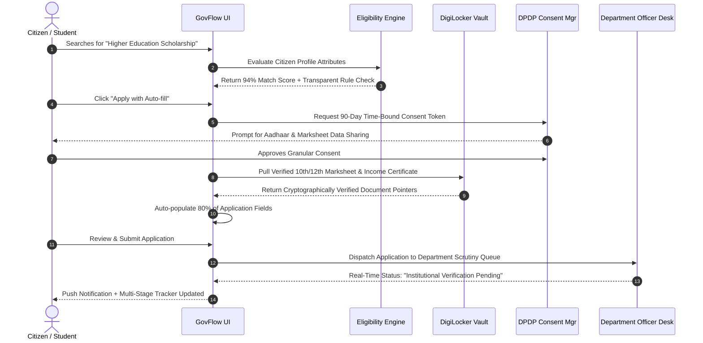

<div align="center">

# 🏛️ GovFlow AI — Unified Smart Government Service Orchestration Platform

<p align="center">
  <strong>One Citizen. One Profile. Every Service. One Smart Journey.</strong><br>
  <em>From fragmented government portals to one intelligent, federated digital civic experience.</em>
</p>

[](https://react.dev/)
[](https://www.typescriptlang.org/)
[](https://vitejs.dev/)
[](https://tailwindcss.com/)
[](https://www.meity.gov.in/)
[](https://guidelines.india.gov.in/)
[](#-multilingual-localization-11-languages)
[](package.json)

</div>

---

## 📑 Table of Contents

- [🏛️ Executive Overview](#️-executive-overview)
- [⚡ The Civic Problem vs The GovFlow AI Solution](#-the-civic-problem-vs-the-govflow-ai-solution)
- [🏗️ Architectural Pillars & Principles](#️-architectural-pillars--principles)
- [✨ Key Platform Modules](#-key-platform-modules)
  - [1. Citizen Experience Portal](#1-citizen-experience-portal)
  - [2. Multilingual Conversational AI Assistant](#2-multilingual-conversational-ai-assistant)
  - [3. DigiLocker Vault & DPDP Consent Manager](#3-digilocker-vault--dpdp-consent-manager)
  - [4. Dynamic Eligibility Checker & Auto-Fill Orchestration](#4-dynamic-eligibility-checker--auto-fill-orchestration)
  - [5. Centralized Grievance Redressal (CPGRAMS Style)](#5-centralized-grievance-redressal-cpgrams-style)
  - [6. Agriculture & Rural Command Center](#6-agriculture--rural-command-center)
  - [7. Department Officer Scrutiny Console](#7-department-officer-scrutiny-console)
  - [8. Department Administrator Console](#8-department-administrator-console)
  - [9. National System Administrator Console](#9-national-system-administrator-console)
  - [10. GIGW Accessibility & Cookie Management](#10-gigw-accessibility--cookie-management)
- [📊 Service & Department Catalogue](#-service--department-catalogue)
- [🏛️ System Architecture & Data Flows](#️-system-architecture--data-flows)
- [📂 Project Directory Structure](#-project-directory-structure)
- [👥 User Roles & Evaluation Credentials](#-user-roles--evaluation-credentials)
- [🚀 Getting Started & Local Development](#-getting-started--local-development)
- [🛡️ Security, Privacy & DPDP Compliance](#️-security-privacy--dpdp-compliance)
- [🌐 Multilingual Localization (11 Languages)](#-multilingual-localization-11-languages)
- [🔮 Future Roadmap](#-future-roadmap)
- [📄 License & Disclaimers](#-license--disclaimers)

---

## 🏛️ Executive Overview

India has built world-class **Digital Public Infrastructure (DPI)** — including Aadhaar, UPI, DigiLocker, API Setu, UMANG, and PFMS (Public Financial Management System). However, for everyday citizens, accessing public welfare programs and civic services still requires navigating across dozens of fragmented ministerial websites, re-entering identical demographic details, uploading the same physical proofs repeatedly, and tracking statuses across disjointed portals.

**GovFlow AI** is a next-generation **Federated Smart Civic Orchestration Layer**. It unites national, state, district, and municipal welfare schemes into a single, intuitive, citizen-centric digital journey. 

Rather than replacing underlying ministerial databases, GovFlow AI acts as a **smart orchestration bridge** that:
1. Translates informal citizen inquiries into verified official scheme matches using rule-based AI.
2. Securely pulls verified credentials from DigiLocker and API Setu via fine-grained, revocable DPDP Act 2023 consent tokens.
3. Automatically populates official multi-stage application forms.
4. Provides a unified, transparent 5-stage tracking timeline with real-time DBT disbursement status and formal application withdrawal capabilities.
5. Provides department officers with pre-verified scrutiny consoles that reduce application turnaround time by up to 60%.

---

## ⚡ The Civic Problem vs The GovFlow AI Solution

| Metric / Dimension | Traditional Public Service Experience | With GovFlow AI Smart Orchestration |
| :--- | :--- | :--- |
| **Portal Discovery** | 50+ separate URLs (central, state, municipal, district) | **Single Civic Portal** with omni-channel conversational search |
| **Identity & Data Entry** | Repeated manual data entry (Aadhaar, income, IFSC, address) | **Unified Citizen Profile** with automated cross-scheme form orchestration |
| **Document Verification** | Scanning & re-uploading physical certificates repeatedly | **DigiLocker Cryptographic Vault** with single-click verified pull |
| **Eligibility Assessment** | Complex 40-page PDFs with fine-print qualification rules | **Instant Rule-Based Match Score** with transparent qualification reasons |
| **Application Tracking** | Disconnected tracking codes, silent rejections, no desk visibility | **Unified Multi-Stage Timeline** with live audit logs and officer notes |
| **Data Privacy & Control** | Permanent data sharing with no visibility or revocation | **DPDP Act 2023 Consent Manager** with time-bound, revocable data tokens |
| **Linguistic Accessibility** | Predominantly English and Hindi interfaces | **11 Official Indian Languages** with dynamic runtime translation |
| **Officer Scrutiny SLA** | High manual verification load with high risk of fraudulent uploads | **Verified Officer Desk** with tamper-proof DigiLocker validation |

---

## 🏗️ Architectural Pillars & Principles

```
┌─────────────────────────────────────────────────────────────────────────────┐
│                           CITIZEN EXPERIENCE LAYER                          │
│   Multilingual Web App • AI Chatbot • Life-Events Hub • Universal Search   │
└──────────────────────────────────────┬──────────────────────────────────────┘
                                       │
┌──────────────────────────────────────▼──────────────────────────────────────┐
│                     GOVFLOW AI CIVIC ORCHESTRATION ENGINE                   │
│  ┌───────────────────────┐  ┌──────────────────────┐  ┌──────────────────┐  │
│  │ AI Eligibility Engine │  │ DPDP Consent Manager │  │ Form Orchestrator│  │
│  │ (Rules & Match Score) │  │  (Granular 90d Token)│  │ (Auto-fill Vault)│  │
│  └───────────────────────┘  └──────────────────────┘  └──────────────────┘  │
│  ┌───────────────────────┐  ┌──────────────────────┐  ┌──────────────────┐  │
│  │ Application Lifecycle │  │ Grievance Redressal  │  │ Accessibility    │  │
│  │   & Withdrawal Policy │  │  (CPGRAMS-aligned)   │  │   (GIGW 3.0)     │  │
│  └───────────────────────┘  └──────────────────────┘  └──────────────────┘  │
└──────────────────────────────────────┬──────────────────────────────────────┘
                                       │
┌──────────────────────────────────────▼──────────────────────────────────────┐
│                    DIGITAL PUBLIC INFRASTRUCTURE (DPI)                      │
│   DigiLocker • API Setu • Aadhaar DBT • PFMS • State Portals • UMANG       │
└─────────────────────────────────────────────────────────────────────────────┘
```

1. **Non-Invasive Federated Architecture**: Works on top of existing central, state, and local systems through API Setu and standard government REST gateways.
2. **Citizen-First Data Minimization**: Complies with the Digital Personal Data Protection (DPDP) Act 2023. Data is shared strictly on a purpose-bound, time-limited, revocable basis.
3. **Deterministic & Explainable AI**: Eligibility checks do not rely on opaque generative hallucination; they execute exact ministerial qualification rules and display clear green/amber checkboxes for each rule.
4. **Resilient Local-First State Machine**: Operates with a client-side sandbox database (`localStorage`) that persists session tokens, profiles, applications, consents, notifications, and audit logs with zero external database dependencies during evaluations.
5. **Universal Accessibility (GIGW 3.0)**: Supports font scaling (`sm`, `base`, `lg`), a high-contrast mode, reduced motion animations, and screen-reader accessible ARIA roles.

---

## ✨ Key Platform Modules

### 1. Citizen Experience Portal
- **Cinematic 20-Second Onboarding / Splash Screen**: Multi-stage visual introduction demonstrating the GovFlow civic stack, with instant session-memory bypass for returning visitors.
- **Natural Language Conversational Search**: Allows citizens to search in everyday conversational phrases (e.g., *"I am a degree student looking for college fee support"* or *"PM Kisan installment not credited"*).
- **13 Comprehensive Service Categories**: Identity & Certificates, Education, Employment, Healthcare, Agriculture, Housing, Financial Assistance, Business & MSME, Transport, Social Welfare, Land & Property, Municipal Services, and Grievance Services.
- **6 Life-Event Service Hubs**:
  1. 🎓 *Starting College & Higher Education*
  2. 💼 *Looking for Employment & Skill Development*
  3. 🏢 *Starting a Business & MSME Enterprise*
  4. 🏠 *Buying or Building a Home*
  5. 🌾 *Farming, Agriculture & Allied Sectors*
  6. 👵 *Senior Citizen Pensions & Healthcare*

### 2. Multilingual Conversational AI Assistant
- Integrated **floating civic widget** and a dedicated `/assistant` page.
- Natural language intent classification matching citizen needs to 30+ official schemes.
- Auto-detects keywords (scholarships, certificates, housing, farming, loans, health).
- Recommends exact services, direct eligibility checker links, and required document checklists in 11 Indian languages.

### 3. DigiLocker Vault & DPDP Consent Manager
- **DigiLocker Document Vault (`/documents`)**:
  - Pulls and stores verified digital credentials (Aadhaar Card, PAN Card, 10th/12th Degree Certificates, Income & Asset Certificate, Land Bhoomi RTC records).
  - Simulates cryptographic SHA-256 tamper-proof verification badges.
  - Manual upload fallback with automatic file categorization.
- **DPDP Act 2023 Consent Manager (`/consent`)**:
  - Transparent inventory of every active data-sharing token.
  - Displays requesting department, specific attributes accessed, purpose, validity period (e.g., 90-day time-bound), and status (`active` / `denied`).
  - Citizens can revoke consent instantly with a single toggle.

### 4. Dynamic Eligibility Checker & Auto-Fill Orchestration
- **Eligibility Checker (`/eligibility/:serviceId`)**:
  - Compares citizen demographic profile (income, social category, education, state domicile, landholding) against ministerial eligibility rules.
  - Generates a **Percentage Match Score** (e.g., *94% Rule Match*).
  - Outlines exact unmet criteria or expiring documents with actionable advice.
- **Auto-Fill Application Workflow (`/services/:id/apply`)**:
  - Auto-populates 80% of required form fields from the verified Citizen Profile.
  - Automatically attaches verified DigiLocker documents.
  - Step-by-step review before formal cryptographic submission.

### 5. Centralized Grievance Redressal (CPGRAMS Style)
- Accessible at `/grievances`.
- Enables citizens to file official grievances against any central, state, or municipal body.
- Generates a unique tracking number (e.g., `CPGRAMS-2026-XXXX`).
- Multi-tier resolution pipeline: *Submitted ➔ Under Investigation ➔ Action Taken ➔ Resolved / Escalated*.
- Officer remarks and file attachment support.

### 6. Agriculture & Rural Command Center
- Dedicated agri-dashboard at `/agriculture`.
- **PM-KISAN DBT Tracker**: View installment histories, Aadhaar-NPCI seeding status, and next disbursement dates.
- **PM Fasal Bima Yojana (PMFBY)**: Crop loss insurance coverage, claims tracking, and policy renewal.
- **Live Mandi Commodity Ticker**: Real-time prices for regional agricultural produce (Wheat, Paddy, Cotton, Mustard).
- **Soil Health Card & Advisory**: Nutrient health alerts, NPK recommendations, and localized weather advisories.

### 7. Department Officer Scrutiny Console
- Accessible at `/officer/dashboard` and `/department/applications`.
- Scoped to the officer's specific department (e.g., *Higher Education*, *Revenue*, *Agriculture*).
- Allows verification officers to:
  - Inspect citizen submissions, form data, and attached DigiLocker certificates.
  - Advance applications across workflow stages (*Institutional Verification*, *Document Validation*, *Approval*, *PFMS DBT*).
  - Request additional clarification or update application status (*Approved*, *Rejected*, *Under Verification*).
  - Add internal verification remarks that are tracked in the audit trail.

### 8. Department Administrator Console
- Accessible at `/department-admin/dashboard` and under `/department/*`.
- **SLA & Bottleneck Analytics**: Visual charts powered by Recharts tracking submission trends, category distribution, and average clearance times.
- **Workflow & Service Configuration**: Review departmental service offerings and active workflow definitions.
- **Departmental Audit Logs**: Granular logging of every officer and system action.

### 9. National System Administrator Console
- Accessible at `/admin/dashboard` and `/admin/services`.
- **Universal Service Registry**: Register new public services, configure dynamic eligibility rules, specify required documents, and set formal application withdrawal policies.
- **API Setu & DPI Gateway Monitor**: Real-time operational health, latency metrics, request counts, and error rates across national integrations (DigiLocker, UIDAI, PFMS, State SDC).
- **System-Wide Audit Logs**: Security event tracing, role changes, and administrative actions.
- **Environment Switcher**: One-click toggle between *Clean Production Mode* (empty initial database) and *Isolated Sandbox Evaluation Mode* (pre-loaded with realistic SIH evaluation personas).

### 10. GIGW Accessibility & Cookie Management
- **Accessibility Drawer (`AccessibilityDrawer.tsx`)**: Text size controls (`Default`, `Medium +20%`, `Large +40%`), High Contrast toggle, and Reduced Motion toggle.
- **Privacy & Cookie Banner (`CookieBanner.tsx` / `CookiePreferencesModal.tsx`)**: Granular control over essential, preferences, and analytics cookies conforming to Indian IT rules.

---

## 📊 Service & Department Catalogue

GovFlow AI includes **35 Officially Catalogued Government Departments** and **30 Pre-Configured Live Digital Services**:

### Department Distribution Across Tiers
| Administrative Tier | Department Count | Representative Authorities |
| :--- | :---: | :--- |
| **Central Ministries** | **30** | Ministry of Education, Ministry of Agriculture & Farmers Welfare, Ministry of Electronics & IT (MeitY), Ministry of MSME, Ministry of Health & Family Welfare, Ministry of External Affairs, Ministry of Labour & Employment, Ministry of Rural Development, etc. |
| **State Departments** | **2** | Karnataka Department of Revenue, Karnataka Seva Sindhu Portal |
| **District Administrations** | **1** | District Magistrate / Deputy Commissioner Office |
| **Municipal Corporations** | **2** | Bruhat Bengaluru Mahanagara Palike (BBMP), Directorate of Municipal Administration |

### Key Pre-Configured Schemes
- **Education**: PM Post-Matric Scholarship, Central Sector Scholarship Scheme, National Means-cum-Merit Scholarship.
- **Employment & Skills**: PM Kaushal Vikas Yojana (PMKVY 4.0), National Career Service Registration, e-Shram Social Security Card.
- **Agriculture**: PM-KISAN Samman Nidhi, PM Fasal Bima Yojana (Crop Insurance), PM-KUSUM Solar Pump Subsidy, Soil Health Card.
- **Housing & Urban**: Pradhan Mantri Awas Yojana (PMAY-Urban / Gramin), Jal Jeevan Mission Water Connection.
- **Health & Social Welfare**: Ayushman Bharat PM-JAY (₹5L Health Cover), ABHA Digital Health Account, Indira Gandhi National Old Age Pension (IGNOAPS), Jan Aushadhi Generic Medicine Scheme.
- **Business & MSME**: Prime Minister's Employment Generation Programme (PMEGP), Udyam MSME Registration, Pradhan Mantri MUDRA Yojana.
- **Identity & Certificates**: Income & Asset Certificate, Domicile/Residence Certificate, Caste Certificate, DigiLocker Driving License, Passport Seva Renewal, Voter ID (EPIC) Online Correction.

---

## 🏛️ System Architecture & Data Flows

### 1. High-Level System Architecture



---

### 2. Citizen Application & DPDP Consent Sequence



---

## 📂 Project Directory Structure

```text
GovFlow_AI/
├── index.html                     # HTML5 entry with Google Fonts (Plus Jakarta Sans & Inter)
├── package.json                   # Dependencies (React 19, Recharts, Lucide, Tailwind, Vite)
├── tailwind.config.js             # Custom GovFlow civic design system tokens (navy, blue, saffron, green)
├── tsconfig.json                  # TypeScript compiler configuration
├── vite.config.ts                 # Vite bundler configuration
│
├── public/                        # Static assets and favicon
│
├── scratch/
│   └── verify_catalogue.ts        # Automated verification test suite for departments & services
│
└── src/
    ├── App.tsx                    # Main router, route guards, splash screen, and global providers
    ├── main.tsx                   # React 19 root bootstrap
    ├── index.css                  # Global Tailwind directives, custom scrollbars, animations
    │
    ├── types/
    │   └── index.ts               # Core TypeScript definitions (User, Service, Application, AuditLog, etc.)
    │
    ├── store/
    │   ├── GovFlowContext.tsx     # Centralized state provider, RBAC controls, and persistence logic
    │   ├── servicesData.ts        # Comprehensive catalogue of 30 government schemes with eligibility rules
    │   ├── departmentData.ts      # Complete catalogue of 35 Central, State & Municipal departments
    │   └── mockData.ts            # Realistic demonstration profiles, initial logs, and sandbox seed data
    │
    ├── services/
    │   └── api.ts                 # Full GovFlowApiService: salted SHA-256 auth, CRUD, search & DPDP logic
    │
    ├── i18n/
    │   └── translations.ts        # Localization dictionaries for 11 official Indian languages
    │
    ├── components/
    │   ├── cards/
    │   │   ├── ApplicationCard.tsx   # Citizen application tracking summary card
    │   │   ├── CategoryCard.tsx      # Domain category browser card
    │   │   ├── DocumentCard.tsx      # DigiLocker certificate card with status badges
    │   │   ├── LifeEventCard.tsx     # Life-event cluster selection card
    │   │   └── ServiceCard.tsx       # Scheme preview card with match score and tags
    │   │
    │   └── common/
    │       ├── AIAssistantWidget.tsx # Floating conversational chatbot widget
    │       ├── AccessibilityDrawer.tsx# Text scaling, high contrast, and reduced motion settings
    │       ├── CookieBanner.tsx      # DPDP compliant cookie consent banner
    │       ├── CookiePreferencesModal.tsx # Granular cookie selection modal
    │       ├── DemoRoleBanner.tsx    # Top environment bar with role switching and sandbox toggle
    │       ├── DocumentUploadModal.tsx# File upload & DigiLocker simulation modal
    │       ├── ErrorFallback.tsx     # Graceful error boundary component
    │       ├── Footer.tsx            # Comprehensive civic footer with official portals & disclaimers
    │       ├── FormField.tsx         # Reusable accessible form input component
    │       ├── GovFlowLogo.tsx       # Scalable SVG civic logo with emblem and typography
    │       ├── Navbar.tsx            # Sticky navigation bar with search, language switcher & user menu
    │       ├── ProtectedRoute.tsx    # Role-based route protection guard
    │       ├── SplashScreen.tsx      # Cinematic 20-second multi-stage introduction screen
    │       └── WithdrawalModal.tsx   # Formal application withdrawal dialog with reason capture
    │
    └── pages/
        ├── LandingPage.tsx           # Flagship civic landing page with interactive network & stats
        ├── ServicesPage.tsx          # Full scheme catalogue with multi-filter sidebar & search
        ├── ServiceDetailPage.tsx     # Deep dive into scheme guidelines, eligibility, and documents
        ├── ApplicationFormPage.tsx   # Multi-step auto-filled application submission wizard
        ├── ApplicationsPage.tsx      # Citizen tracker for all submitted, active, and past applications
        ├── ApplicationDetailPage.tsx # Real-time multi-stage tracking timeline & officer remarks
        ├── DashboardPage.tsx         # Citizen dashboard with profile completion and scheme recommendations
        ├── DocumentsPage.tsx         # DigiLocker digital vault management
        ├── ConsentPage.tsx           # DPDP Act 2023 Consent Manager
        ├── EligibilityCheckerPage.tsx# Dynamic rule-based qualification calculator
        ├── AssistantPage.tsx         # Full-page multilingual AI assistant
        ├── GrievancePage.tsx         # CPGRAMS-aligned centralized grievance submission & tracking
        ├── AgricultureDashboardPage.tsx # PM-KISAN, PMFBY crop insurance, Mandi rates & soil health
        ├── DepartmentsPage.tsx       # Directory of 35 Central, State, and Municipal departments
        ├── CertificatesPage.tsx      # Identity & citizen certificates issuance hub
        ├── SearchPage.tsx            # Advanced search with category and ministry facets
        ├── ProfilePage.tsx           # Citizen personal profile, DigiLocker KYC, and preferences
        ├── NotificationsPage.tsx     # Action alerts, deadline reminders, and status dispatches
        ├── LoginPage.tsx             # Multi-role authentication with provisioned test credentials
        ├── RegisterPage.tsx          # New citizen account self-registration
        ├── PrivacyPage.tsx           # DPDP Act 2023 privacy policy and data governance disclosure
        ├── CookiesPage.tsx           # Cookie policy disclosure
        ├── AccessibilityPage.tsx     # GIGW 3.0 accessibility standards statement
        │
        ├── admin/
        │   ├── AdminDashboardPage.tsx# National system overview, API Setu health, audit logs
        │   └── AdminServicesPage.tsx # Scheme registry CRUD and withdrawal policy configuration
        │
        └── department/
            ├── DepartmentLayout.tsx  # Sidebar layout for departmental administration
            ├── OfficerDashboardPage.tsx # Verification officer scrutiny desk & queue management
            ├── DepartmentDashboard.tsx  # Department overview and real-time intake statistics
            ├── DepartmentApplications.tsx# Application queue filtering, review, and status advance
            ├── DepartmentServices.tsx    # Departmental service list
            ├── DepartmentWorkflows.tsx   # Multi-stage workflow definitions
            ├── DepartmentDocuments.tsx   # Document verification queue
            ├── DepartmentIntegrations.tsx# Ministry API Setu endpoints status
            ├── DepartmentAuditLogs.tsx   # Tamper-proof departmental activity audit trail
            └── DepartmentAnalytics.tsx   # SLA performance and district bottleneck charts
```

---

## 👥 User Roles & Evaluation Credentials

GovFlow AI implements **Strict Role-Based Access Control (RBAC)**. To allow seamless demonstration and evaluation during hackathons and reviews, official accounts are pre-provisioned in the system:

| Role Identifier | Portal Area | Purpose & Permissions | Pre-Provisioned Demo Account | Password |
| :--- | :--- | :--- | :--- | :--- |
| **Citizen** (`citizen`) | `/dashboard`<br>`/applications`<br>`/documents`<br>`/consent` | Search schemes, test eligibility, auto-fill applications, manage DigiLocker documents, revoke DPDP consent tokens. | Self-register via `/register`<br>— or select demo user in Sandbox Mode | Configured at registration |
| **Department Officer** (`officer` / `DEPARTMENT_OFFICER`) | `/officer/dashboard`<br>`/department/*` | Scrutinize applications for the Education Department, inspect DigiLocker marksheets, approve/reject stages, add officer remarks. | **ID:** `OFFICER001`<br>*(or `officer001@govflow.gov.in`)* | **`Officer@123`** |
| **System Administrator** (`sys_admin` / `SYSTEM_ADMIN`) | `/admin/dashboard`<br>`/admin/services`<br>`/admin/audit-logs` | National system oversight, add new schemes to universal catalogue, monitor API Setu health, inspect cryptographic audit logs, toggle Sandbox Mode. | **ID:** `ADMIN001`<br>*(or `admin001@govflow.ai`)* | **`Admin@123`** |

> [!TIP]
> **One-Click Test Credential Helper**: On the [Sign In Page (`/login`)](http://localhost:5173/login), click **"View Provisioned Government Test Credentials"** to automatically populate `OFFICER001` or `ADMIN001` with pre-filled identifiers.

### Environment Modes
1. **Clean Production Mode (Default)**: Starts with an empty citizen database. Evaluators can create a brand new citizen account at `/register` to test realistic end-to-end onboarding.
2. **Sandbox Evaluation Mode**: Toggleable from the top **Demo Role Banner** or the **Admin Dashboard**. Pre-loads realistic citizen profiles (*Ananya Sharma - Student*, *Rajesh Kumar - Farmer*, *Priya Patel - MSME Owner*), pre-populated applications, and notifications for rapid demonstration.

---

## 🚀 Getting Started & Local Development

### Prerequisites
- **Node.js**: Version `18.x` or higher (tested on Node v20/v22)
- **Package Manager**: `npm` (version 9+)

### Installation & Execution

1. **Clone or Navigate to the Workspace**:
   ```bash
   cd GovFlow_AI
   ```

2. **Install Dependencies**:
   ```bash
   npm install
   ```

3. **Start the Local Development Server**:
   ```bash
   npm run dev
   ```
   Open your browser and navigate to **`http://localhost:5173`**.

4. **Verify Type-Safety & Build Production Bundle**:
   ```bash
   npm run build
   ```
   Compiles TypeScript and bundles production-ready assets into the `dist/` directory.

5. **Run the Automated Catalogue Verification Test Suite**:
   ```bash
   npx tsx scratch/verify_catalogue.ts
   ```
   Validates integrity across all 35 departments, 30 services, eligibility rule formats, and 20-second splash screen intervals.

---

## 🌐 Deploying to Render (Live Web Service)

GovFlow AI is fully configured to run live as a **Node.js Web Service** on Render, complete with an **Express 5 SPA server (`server.js`)**, automated **health check probe (`/healthz`)**, and Infrastructure-as-Code blueprint ([`render.yaml`](file:///d:/Internship/Full%20Stack%20Projects/GovFlow_AI/render.yaml)). This enables 24/7 cloud availability accessible from any mobile or desktop browser without local dependencies.

### Option A: 1-Click Blueprint (Recommended)
1. Go to **[dashboard.render.com](https://dashboard.render.com)** and sign in.
2. Click **New +** ➔ **Blueprint**.
3. Connect your GitHub repository: `https://github.com/ybhargavi40021978-alt/GovFlow-AI.git`.
4. Render will auto-detect [`render.yaml`](file:///d:/Internship/Full%20Stack%20Projects/GovFlow_AI/render.yaml) and automatically configure the Web Service with:
   - **Environment:** `Node`
   - **Build Command:** `npm install && npm run build`
   - **Start Command:** `npm start`
   - **Health Check Path:** `/healthz`
5. Click **Apply**. Render will build and deploy the live web service with a public URL (e.g., `https://govflow-ai.onrender.com`).

### Option B: Manual Web Service Setup
1. On Render Dashboard, click **New +** ➔ **Web Service**.
2. Select your repository: `GovFlow-AI`.
3. Configure the settings:
   - **Name:** `govflow-ai`
   - **Region:** Any (e.g. Oregon, Frankfurt, Singapore)
   - **Branch:** `main`
   - **Root Directory:** *(leave blank)*
   - **Runtime:** `Node`
   - **Build Command:** `npm install && npm run build`
   - **Start Command:** `npm start`
   - **Plan:** `Free`
4. Expand **Advanced**:
   - **Health Check Path:** `/healthz`
5. Click **Create Web Service**. Your live production instance will be built and launched with an automated HTTPS URL!

---

## 🛡️ Security, Privacy & DPDP Compliance

GovFlow AI is architected in accordance with the **Digital Personal Data Protection (DPDP) Act 2023**:

1. **Cryptographic Password Security**: Passwords are never stored in plaintext. They are salted using a secure national salt and hashed using **SHA-256 via the native Web Crypto API (`crypto.subtle`)**.
2. **Consent-Before-Transmission**: No department or external API receives citizen data without explicit, granular consent granted in the DPDP Consent Hub.
3. **Purpose Limitation & Time Decay**: All consent records include an explicit `purpose` and default `expiresAt` timestamp (90 days).
4. **Instant Revocation**: Citizens can revoke active consents at any moment from `/consent`, immediately terminating data exchange for subsequent workflows.
5. **Tamper-Proof Audit Logging**: Every administrative action, application submission, officer status advance, and consent state transition generates an immutable `AuditLog` entry recording actor ID, role, action, target resource, timestamp, and result.

---

## 🌐 Multilingual Localization (11 Languages)

GovFlow AI features native support for **11 Official Indian Languages**, accessible via the language switcher in the global header:

| Language | Script Name | Code | Coverage |
| :--- | :--- | :---: | :--- |
| **English** | English | `en` | 100% Comprehensive |
| **Hindi** | हिन्दी | `hi` | 100% Comprehensive |
| **Tamil** | தமிழ் | `ta` | 100% Comprehensive |
| **Telugu** | తెలుగు | `te` | 100% Comprehensive |
| **Kannada** | ಕನ್ನಡ | `kn` | UI & Key Headings |
| **Malayalam** | മലയാളം | `ml` | UI & Key Headings |
| **Bengali** | বাংলা | `bn` | UI & Key Headings |
| **Marathi** | मराठी | `mr` | UI & Key Headings |
| **Gujarati** | ગુજરાતી | `gu` | UI & Key Headings |
| **Punjabi** | ਪੰਜਾਬੀ | `pa` | UI & Key Headings |
| **Urdu** | اردو | `ur` | UI & Key Headings |

---

## 🔮 Future Roadmap

- [ ] **Direct DigiLocker OAuth2 Integration**: Transitioning from simulated credential exchange to live DigiLocker production gateway authorization.
- [ ] **Bhashini AI Voice Bot**: Incorporating AI speech-to-text and text-to-speech for conversational voice inquiries in regional dialects.
- [ ] **State Service Delivery Gateway (SSDG) Connectors**: Native adapters for state-level citizen portals (e.g., *Seva Sindhu*, *e-District*, *MahaOnline*).
- [ ] **Offline-First Mobile PWA / Native App**: Biometric login (fingerprint/face recognition) and SMS-based status tracking for citizens in low-connectivity rural belts.
- [ ] **Automated DBT Bank Account Seeding Verifier**: Integration with NPCI Bharat Aadhaar Seeding Gateway to prevent scholarship/subsidy disbursement bounces.

---

## 📄 License & Disclaimers

This project is developed as a civic technology initiative designed to advance the vision of transparent, accessible, and intelligent digital governance in India.

- **License**: MIT Open Source License.
- **Civic Disclaimer**: Scheme titles, ministry names, and official guidelines referenced in this application (such as *PM-KISAN*, *PM Post-Matric Scholarship*, *PMAY*, *Ayushman Bharat*) are property of their respective Ministries and Government of India authorities. All integrations in the default build operate in a secure local simulation sandbox.

---

<div align="center">
  <sub>Built with ❤️ for Indian Citizens • Empowering Digital Public Infrastructure</sub>
</div>
